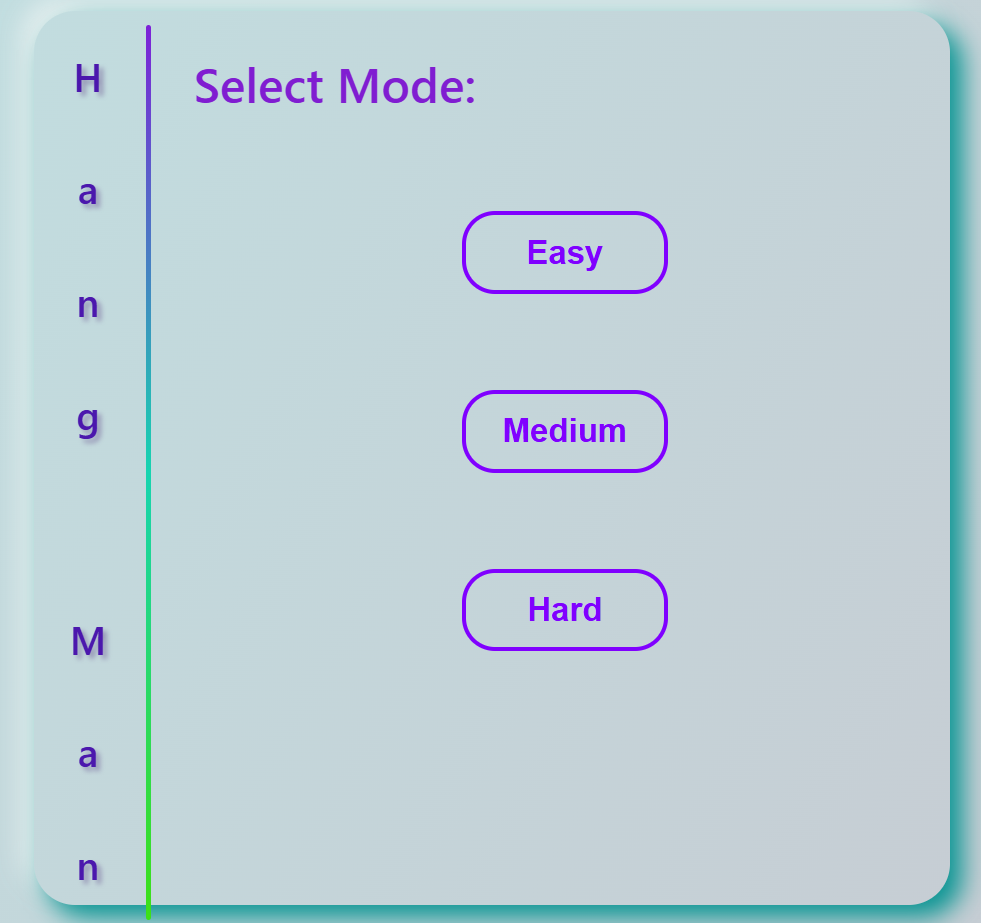
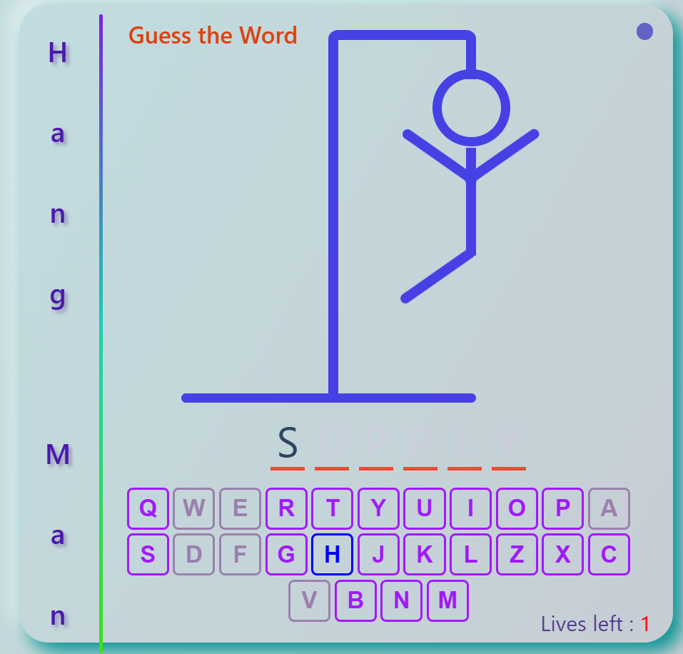
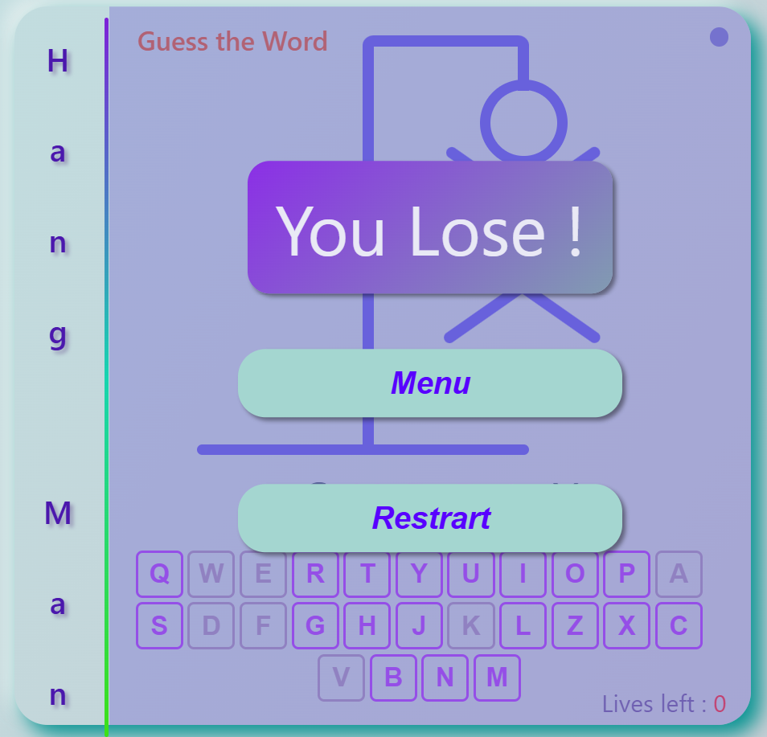

# Hang-man-game

This is a classic Hangman game implemented using HTML, CSS, and JavaScript. It requires a local server environment like XAMPP or VS Code Live Server to run.

Features:

<ul>
<li>Random word selection from a built-in word list</li>
<li>User input for guessing letters</li>
<li>Visual representation of the hangman (body parts added with incorrect guesses)</li>
<li>Win/Lose conditions based on correctly guessed letters</li>
<li>Basic user interface with buttons and text displays</li>
</ul>

Requirements:

<ul>
<li>A web browser</li>
<li>Local server environment (XAMPP or VS Code Live Server recommended)</li>
</ul>

Menu:

Gamw:

Result:

